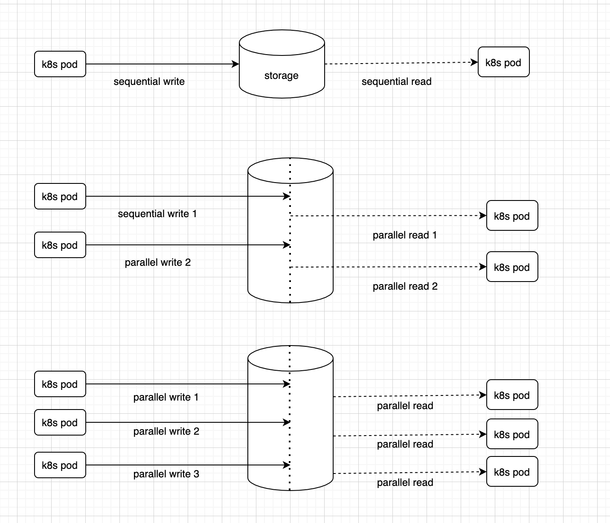

# Read Write Tests

# GID Tests

| File in-volume -->  | file A owned by group G1| file B owned by group G2 |
|--|--|--|
| pod A securityContext.runAsGroup=G1|  RW| |
| pod B securityContext.supplementalGroup=G2|  |RW|
| pod C securityContext.supplementalGroup=G2 and securityContext.runAsGroup=G1| RW |RW|

